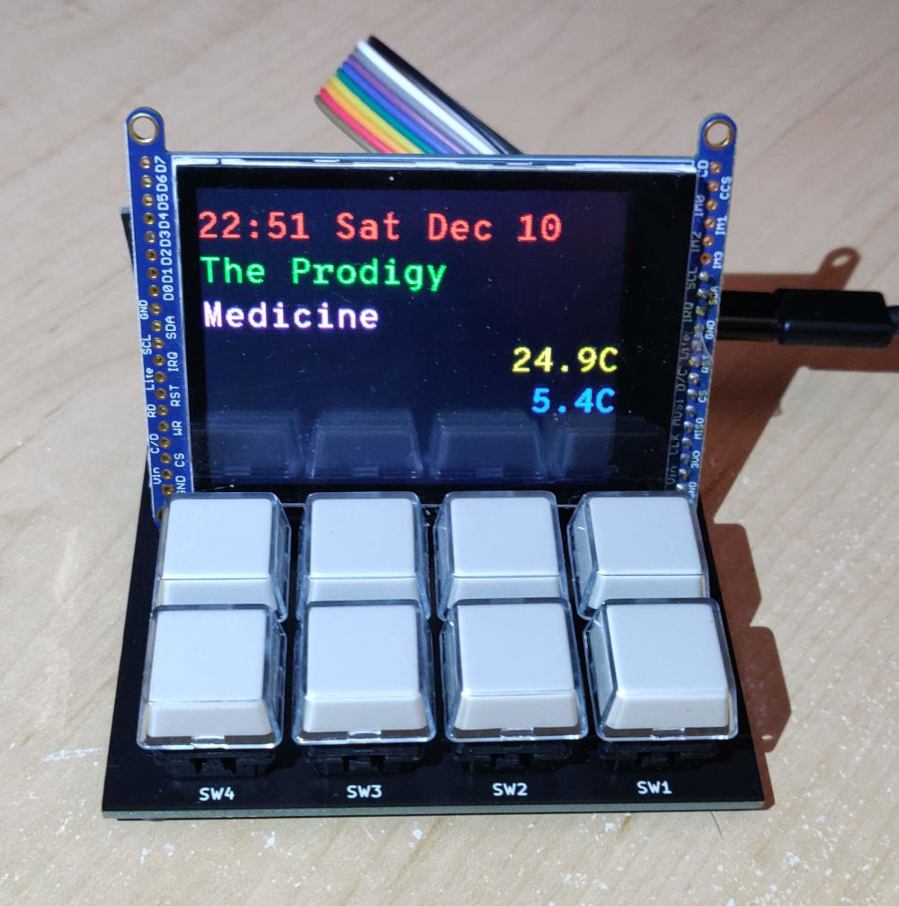
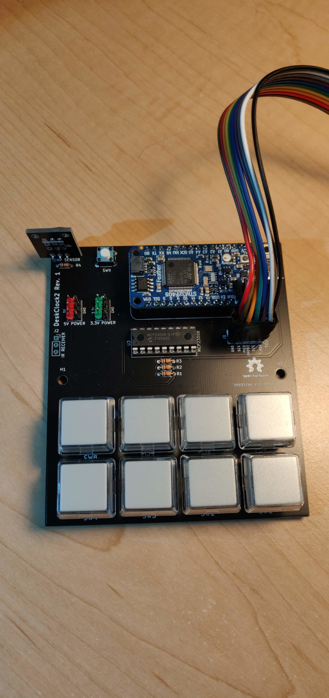
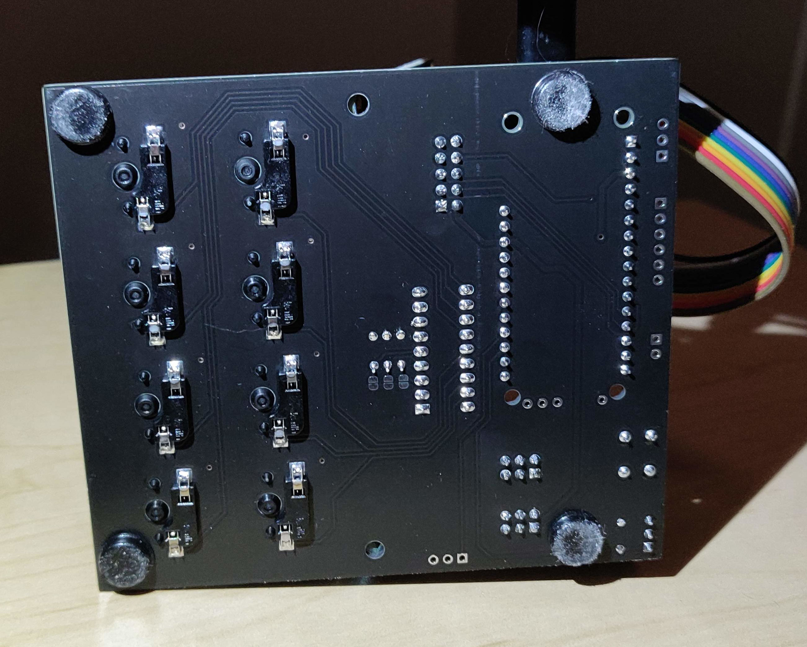
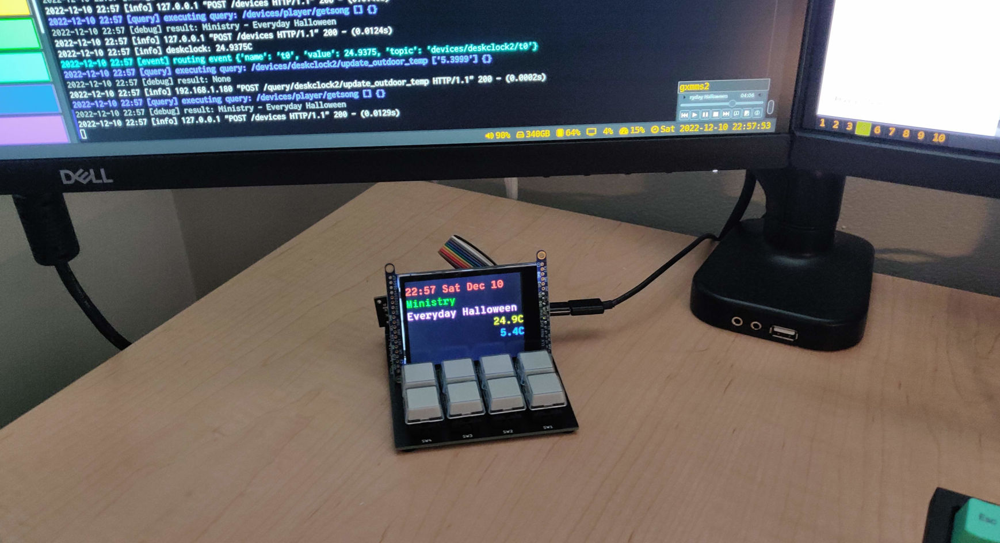
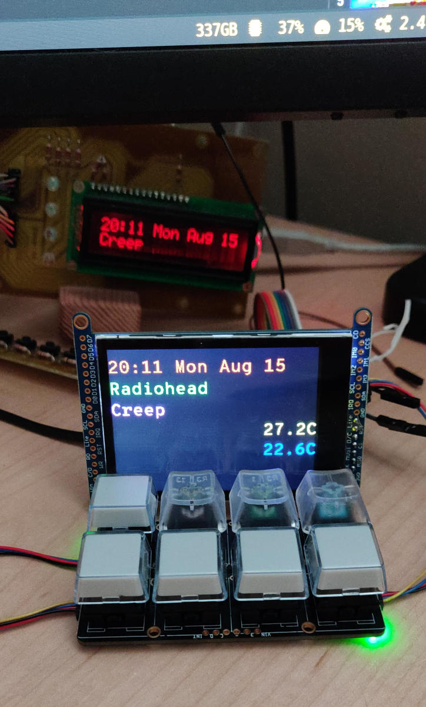

DeskClock 2
===========

###### *Started July 31, 2022*

A desktop companion device for displaying status and controlling things without interrupting flow.
This is a replacement to my previous deskclock project which was originally built in 2009 and later
revamped with an Arduino in 2012.

The new design has an LCD screen, 8 CherryMX buttons, a temperature sensor, an IR receiver, and a
USB connection to my desktop computer.  The controller is a
[Adafruit Feather STM32F405 Express](https://learn.adafruit.com/adafruit-stm32f405-feather-express)
programmed using the Arudino framework.  The computer is running
[Nerve](http://jabberwocky.ca/projects/nerve/), which can perform actions in response to the
buttons, and display information like the current time, current song playing on my computer, and
indoor and outdoor temperature (where the outdoor temperature is broadcast from another computer,
which receives it from a wireless sensor outside).  The buttons are currently configured to control
the music player on my computer, as well as toggle some lights in my computer room.

Custom PCB
----------

Above is the assembled board.  It was designed in November 2022, and assembled in December.

Top down view of the board without the LCD resting on top.  It's a pretty simple design with
an MCP23008 I2C GPIO chip for reading the buttons.

On the bottom, you can see the Kali solderless keyboard button sockets, which are compatible with
CherryMX switches.  They were surprisingly easy to install, align, and solder, using a pre-made
KiCAD footprint.  The sockets snap snugly into the board with no room to wiggle.  I also stuck
some rubber feet to the bottom to clear the sockets from touching the desk, and also to keep it in
place when pressing buttons.

The assembled board with the LCD floating (not securely attached). On the monitor above, you can
see the Python program's log messages showing it receiving the outdoor temperature and sending it
to DeskClock2, and querying the current song to be displayed.

A mistake was made on the board for the IR receiver, which has the power pins reversed.  I attached
a 3 pin header to the board, and with some shrink wrap on one of the pins, bent the power pins to
be reversed when plugged in.

Prototype
---------

Above is the prototype, with the old deskclock to be replaced visible in the background

The prototype is built using an Adafruit
[Feather STM32F405 Express](https://learn.adafruit.com/adafruit-stm32f405-feather-express) with two
[NeoKeys](https://www.adafruit.com/product/4980) and a
[2.8 inch LCD](https://www.adafruit.com/product/2090).

Programming with Arduino
------------------------

In the Arduino IDE:

- select board "Generic STM32F4 Series"
- select board part number "Adafruit Feather STM32F405"
- select USB support "CDC (generic 'Serial' supersede USART)
- select upload method "STM32CubeProgrammer (DFU)"

To put the device in programming mode, hold down the reset button on the Feather, and the Flash button
on the board, and then release the reset button first.

Communication
-------------

The Feather appears as a generic serial-over-USB device.  The protocol is a very simple text format
where each line has a sub-device name/number, followed by an equals sign, and then the data.  For a
button, the device would send "B5=1" when the button is pressed, and "B5=0" when released, where the
number in the name corresponds to the button number between 0 and 7.  The temperature is sent back
as "T0=23.0" where the value is in Celsius.

For the LCD, each of 5 lines is drawn with a separate line to allow them to be updated independently
to avoid flicker due to the slow updated time of the LCD over SPI.  Each line has the form
"L2=Some Text" where the number is the line number to updated, between 0 and 4.  The text can
contain a simple escape code for setting the text colour, of the form "\x1B[3m" which would set the
colour to "3" (green).

The LCD is a passive device, displaying whatever the computer tells it to.  The temperature has to
be sent to the computer, and the computer needs to update the LCD with that information to display
it.  On the Nerve/Computer side, the temperature is also data logged along with other sensors around
the house, so that they can all be displayed on a graph through the web interface.

The IR sensor returns data as "I0=N:40:1", where "N" is NEC protocol, "40" is the address number of
the remote control, and "1" in the command code.

